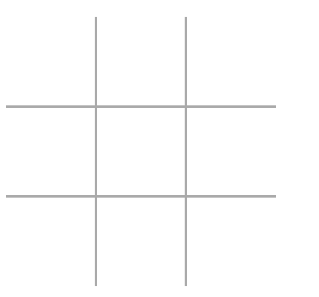

# TicTacToe Game

This is a simple TicTacToe game that can be played by two players. The winner is the first player to get three of their marks in a row, column, or diagonal.

Starting an Empty board is displayed to the players. The players take turns to place their marks on the board. The game ends when a player wins or the board is full.



# How to play

# How to use the project

1. Clone the repository
2. Run the following command to install the required dependencies:

```bash
npm install
```

3. Run the following command to start the game:

```bash
npm run dev
```

4. Open your browser and navigate to `http://localhost:5173/` to play the game.

# Features of the game

- The game can be played by two players.
- The game ends when a player wins or the board is full.
- The game displays the winner when a player wins.

# Technologies used

- HTML

# Author

# License

# Future improvements

- Add a feature to allow players to play against the computer.
- Add a feature to allow players to choose their marks.
